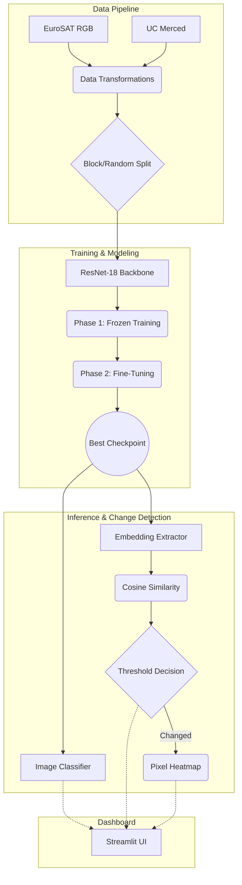

# Satellite Image Land-Use Classifier & Temporal Change Detector

This repo implements the project brief: a transfer-learning land-use classifier,
an embedding-based temporal change detector, and a local Streamlit dashboard.

## 🎬 Demo Video

https://github.com/user-attachments/assets/demo_video/Dashboard_Demo.mp4

<video src="demo_video/Dashboard_Demo.mp4" controls width="100%"></video>

> **Note:** If the video doesn't auto-embed above, you can [download and watch it here](demo_video/Dashboard_Demo.mp4).

## Project Structure

```text
project_1/
├── src/landuse/          — reusable training, model, metric & change-detection code
├── scripts/              — runnable workflows (see below)
├── app/streamlit_app.py  — local dashboard for before/after tile comparison
├── notebooks/            — reproducible exploration & results notebooks
├── configs/thresholds.json — operating points (high_recall / balanced / high_precision)
├── tests/                — smoke tests & comprehensive unit tests
├── reports/              — generated PDF report (after running generate_report.py)
└── runs/                 — all output artefacts (checkpoints, metrics, plots)
```

## Architecture Diagram



## Expected Data Layout

Place datasets under `data/`:

```text
data/
  eurosat/
    AnnualCrop/
    Forest/
    HerbaceousVegetation/
    Highway/
    Industrial/
    Pasture/
    PermanentCrop/
    Residential/
    River/
    SeaLake/
  uc_merced/
    agricultural/
    airplane/
    ...   (21 classes total)
```

**Download links**
- EuroSAT RGB: https://zenodo.org/record/7711810
- UC Merced Land Use: http://vision.ucmerced.edu/datasets/landuse.html

**Automated Download**
You can automatically download and extract both datasets by running:
```bash
python scripts/download_datasets.py
```

## Setup

```bash
python -m venv .venv && source .venv/bin/activate
pip install -r requirements.txt
pip install -e .
```

After setup the dashboard can run locally with no internet dependency.

---

## Full Workflow (run in order)

### Step 1 — Data profile
```bash
python scripts/plot_dataset.py --data-dir data/eurosat --out-dir runs/data_profile
```

### Step 2 — Baseline scratch CNN
```bash
python scripts/train_baseline.py --data-dir data/eurosat --out-dir runs/baseline
```

### Step 3 — Fine-tune ResNet-18 (two-phase strategy)
```bash
python scripts/train_finetune.py --data-dir data/eurosat --out-dir runs/resnet18
```

### Step 4 — Evaluate on EuroSAT (block split)
```bash
python scripts/evaluate.py \
  --data-dir data/eurosat \
  --checkpoint runs/resnet18/best.pt \
  --out-dir runs/resnet18/eurosat_eval \
  --split block
```

### Step 5 — Evaluate on UC Merced holdout
```bash
python scripts/evaluate.py \
  --data-dir data/uc_merced \
  --checkpoint runs/resnet18/best.pt \
  --out-dir runs/resnet18/uc_merced_eval \
  --split all
```

### Step 6 — Change detection (ROC curve + threshold)
```bash
python scripts/run_change_detection.py \
  --data-dir data/eurosat \
  --checkpoint runs/resnet18/best.pt \
  --out-dir runs/change_detection
```

### Step 7 — Save visual heatmaps for 5 region pairs
```bash
python scripts/save_change_heatmaps.py \
  --data-dir data/eurosat \
  --checkpoint runs/resnet18/best.pt \
  --out-dir runs/change_detection/heatmaps \
  --n-pairs 5
```

### Step 8 — Spatial leakage experiment + write-up
```bash
python scripts/spatial_leakage_experiment.py \
  --data-dir data/eurosat \
  --checkpoint runs/resnet18/best.pt \
  --out-dir runs/spatial_leakage
```

### Step 9 — Visual error analysis (top-5 misclassified tiles)
```bash
python scripts/visualize_errors.py \
  --data-dir data/eurosat \
  --checkpoint runs/resnet18/best.pt \
  --out-dir runs/resnet18/error_analysis
```

### Step 10 — Launch Streamlit dashboard (runs locally, no internet needed)
```bash
streamlit run app/streamlit_app.py -- --checkpoint runs/resnet18/best.pt
```

### Step 11 — Generate PDF report
```bash
python scripts/generate_report.py \
  --runs-dir runs \
  --out-path reports/project_report.pdf
```

---

## Notebooks

| Notebook | Purpose |
|---|---|
| `notebooks/01_data_exploration.ipynb` | Dataset download, class distribution, sample tiles, block split documentation, augmentation preview |
| `notebooks/02_results_and_analysis.ipynb` | Loss curves, classification reports, confusion matrices, ROC, heatmaps, spatial leakage, error analysis, t-SNE (Bonus C) |

Run with: `jupyter notebook notebooks/`

---

## Deliverable Mapping

| # | Deliverable | Files |
|---|---|---|
| 1 | Data pipeline | `src/landuse/data.py`, `scripts/plot_dataset.py`, `notebooks/01_data_exploration.ipynb` |
| 2 | Baseline CNN | `src/landuse/models.py` (`ScratchCNN`), `scripts/train_baseline.py` |
| 3 | Fine-tuned model | `scripts/train_finetune.py`, `runs/resnet18/best.pt` |
| 4 | Change detection + heatmaps | `src/landuse/change.py`, `scripts/run_change_detection.py`, `scripts/save_change_heatmaps.py` |
| 5 | Geo-dashboard | `app/streamlit_app.py` |
| 6 | Spatial leakage write-up | `scripts/spatial_leakage_experiment.py` → `runs/spatial_leakage/spatial_leakage_writeup.md` |
| 7 | Error analysis | `scripts/visualize_errors.py` → `runs/resnet18/error_analysis/` |
| 8 | PDF report + demo video | `scripts/generate_report.py` → `reports/project_report.pdf` + screen recording |

---

## ⭐ Bonus Features

| Bonus | Status | Details |
|---|---|---|
| **B — Multi-threshold toggle** | ✅ Implemented | `configs/thresholds.json` defines `high_recall`, `balanced`, `high_precision` thresholds. The Streamlit dashboard sidebar lets you switch between them at runtime. |
| **C — Embedding visualisation (t-SNE)** | ✅ In notebook | See `notebooks/02_results_and_analysis.ipynb` → Section 8 for t-SNE projection of 27k EuroSAT embeddings coloured by class. |
| **A — GradCAM** | ✅ Implemented | Script `scripts/bonus_a_gradcam.py` generates heatmaps for predictions. |
| **D — Imbalance experiment** | ✅ Implemented | `scripts/bonus_d_imbalance.py` downsamples 2 classes to 20% and applies weighted-loss mitigation. Analysis is at `runs/imbalance_experiment/analysis.md`. |

---

## Tests

```bash
pytest tests/
```

Smoke tests cover model forward pass and change helper functions.
