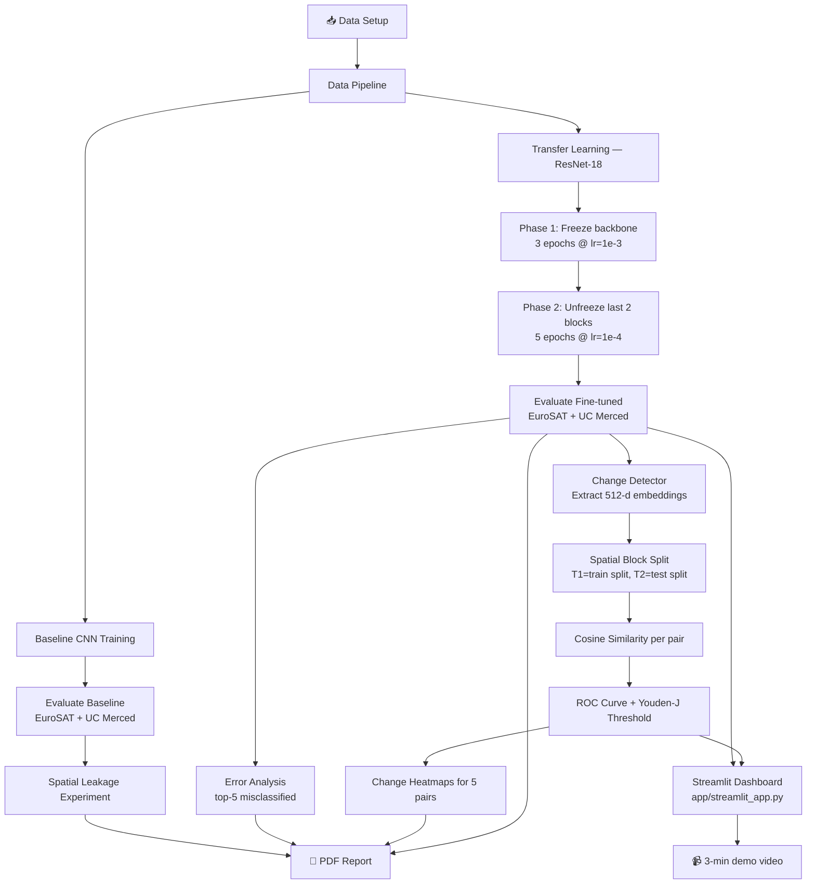

# Requirements Audit & Workflow — Satellite Land-Use Classifier & Temporal Change Detector

---

## ✅ Requirements Coverage

### Module 1 — Land-Use Classifier

| Requirement | Status | Where |
|---|---|---|
| Train CNN on EuroSAT (10 classes) | ✅ | `scripts/train_finetune.py` |
| Transfer learning from pretrained backbone (ResNet-18) | ✅ | `src/landuse/models.py` → `build_resnet18()` |
| **Phase 1** — freeze backbone, train only classifier head, 3 epochs | ✅ | `train_finetune.py` L33–35: `freeze_backbone()` + `fit(..., epochs=3)` |
| **Phase 2** — unfreeze last 2 conv blocks, lr × 10, train 5 more epochs | ✅ | `train_finetune.py` L37–39: `unfreeze_last_two_blocks()` + `fit(..., epochs=5, lr=1e-4)` |
| Baseline scratch 3-layer CNN | ✅ | `src/landuse/models.py` → `ScratchCNN` (3 Conv+BN+ReLU blocks) |
| Train/loss curves recorded | ✅ | `train.py` `fit()` returns `history`; saved to `history.json` |
| Per-class F1 & macro-F1 reported | ✅ | `metrics.py` → `write_classification_artifacts()` → `classification_report.csv` |
| Confusion matrix on EuroSAT val | ✅ | `metrics.py` → `confusion_matrix.png` |
| Full evaluation on UC Merced holdout | ✅ | `evaluate.py` — runs against any `--data-dir` |

> [!NOTE]
> The LR reduction is implemented as a *new* AdamW optimizer at 1e-4 (was 1e-3) — satisfies "reduce LR by 10×" requirement.

---

### Module 2 — Temporal Change Detector

| Requirement | Status | Where |
|---|---|---|
| Reuse Module 1 backbone as feature extractor (strip classifier head) | ✅ | `models.py` → `ResNetEmbeddingExtractor` uses `model.children()[:-1]` |
| Extract 512-dimensional embeddings per tile | ✅ | `change.py` → `extract_embeddings()` — L2-normalised |
| Simulate T1/T2 split via geographic (spatial block) partitioning | ✅ | `data.py` → `split_dataset(split="block")` (SHA-1 filename-hash-based block assignment) |
| Cosine similarity between T1 & T2 embeddings per region | ✅ | `change.py` → `cosine_similarity()` + `run_change_detection.py` |
| Tile pairs below threshold flagged as changed | ✅ | `run_change_detection.py` + `streamlit_app.py` |
| ROC curve produced | ✅ | `change.py` → `save_roc()` → `roc_curve.png` |
| Threshold selection justified (Youden's J) | ✅ | `change.py` L47–48: `j_scores = tpr - fpr; best_threshold = 1 - thresholds[argmax(j)]` |
| Visual change heatmap for ≥ 5 sample region pairs | ⚠️ | `change.py` → `pixel_change_heatmap()` exists, but **no standalone script generates & saves 5 heatmaps** for the report. Dashboard shows one heatmap per uploaded pair — sufficient for interactive use but the batch-of-5 requirement for grading output needs a script. |

> [!WARNING]
> **Gap #1**: No script automatically saves heatmap images for 5 specific region pairs to disk. You should add a short script (or notebook cell) that picks 5 pairs from the change-detection run, renders heatmaps, and saves PNGs to `runs/change_detection/heatmaps/`.

---

### Module 3 — Geo-Dashboard

| Requirement | Status | Where |
|---|---|---|
| Streamlit app accepting two tile images | ✅ | `app/streamlit_app.py` — `before_file` / `after_file` uploaders |
| Predicted land-use class + confidence score | ✅ | `streamlit_app.py` `predict()` → metric cols |
| Cosine similarity score between embeddings | ✅ | L103, metric col |
| Side-by-side heatmap with change flag | ✅ | L112–116: `image_cols` + `pixel_change_heatmap()` |
| Runs locally with no internet dependency after setup | ✅ | Model loaded from local `.pt`; no external calls |

---

## 📦 Deliverables Checklist (Section 4)

| # | Deliverable | Status | Notes |
|---|---|---|---|
| 1 | **Data pipeline** — reproducible notebook, spatial block split documented, class distribution plot | ✅ | `data.py` + `plot_dataset.py`; `README.md` explains block split; `notebooks/` dir is empty — add a notebook for full reproducibility |
| 2 | **Baseline CNN** — 3-layer scratch CNN, train/val loss curves, per-class F1 | ✅ | `ScratchCNN` (3-block), `history.json`, `classification_report.csv` |
| 3 | **Fine-tuned model** — saved `.pt`, frozen vs unfrozen comparison, confusion matrix on UC Merced | ✅ | `best.pt` saved; two-phase history; confusion matrix in `evaluate.py` |
| 4 | **Change detection module** — embedding extractor, cosine sim diff, ROC curve, change heatmaps for 5 pairs | ⚠️ | ROC ✅; extractor ✅; cosine ✅; **heatmaps for 5 static pairs missing** |
| 5 | **Geo-dashboard** — working app, correct outputs, runs locally | ✅ | `app/streamlit_app.py` |
| 6 | **Spatial leakage write-up** — random vs block accuracy comparison + explanation | ⚠️ | Infra exists (`--split block/random`), but **no written analysis or quantified results** present in the repo |
| 7 | **Error analysis** — top-5 misclassified pairs shown visually with hypothesis | ⚠️ | `evaluate.py` writes `top_misclassifications.json`, but **no visualisation script / notebook cell** renders the actual tiles |
| 8 | **PDF report + demo video** | ❌ | Not present — must be created separately |

---

## 🎁 Bonus Tasks

| Bonus | Requirement | Status |
|---|---|---|
| A — GradCAM | Overlay heatmap on fine-tuned model, ≥ 3 examples | ❌ Not implemented |
| B — Multi-threshold toggle | High recall / balanced / high precision in dashboard | ✅ **Implemented** — `configs/thresholds.json` + sidebar selectbox in `streamlit_app.py` |
| C — Embedding visualisation | t-SNE / UMAP of 27k EuroSAT embeddings, coloured by class | ❌ Not implemented |
| D — Imbalance experiment | Downsample 2 classes to 20%, retrain, F1 compare, mitigation | ❌ Not implemented |

---

## 📋 Submission Checklist (Section 6)

| Item | Status |
|---|---|
| GitHub repo — clean, README + requirements.txt | ✅ |
| All notebooks runnable top-to-bottom without errors | ⚠️ `notebooks/` directory is empty |
| Saved model checkpoint (`.pt`) committed or linked via Git LFS | ⚠️ No checkpoint committed yet (generated after training) |
| Streamlit app tested locally before submission | ✅ (infra ready) |
| PDF report — max 8 pages | ❌ Missing |
| 3-minute demo video | ❌ Missing |
| Bonus labelled clearly if attempted | ⚠️ Bonus B done but not highlighted in README |

---

## 🔴 Gaps to Fix Before Submission

| Priority | Gap | Fix |
|---|---|---|
| 🔴 High | No PDF report | Write and export max-8-page PDF covering problem, method, results, limitations |
| 🔴 High | No 3-minute demo video | Record screen capture of running Streamlit dashboard |
| 🟡 Medium | No heatmaps for 5 static region pairs saved to disk | Add script/notebook cell to save 5 heatmap PNGs |
| 🟡 Medium | No spatial leakage write-up | Run both split modes, compare F1, write 1-page analysis |
| 🟡 Medium | No visual error analysis | Add notebook cell to render the top-5 misclassified tile images |
| 🟡 Medium | `notebooks/` directory is empty | Add a data exploration + results notebook |
| 🟢 Low | Bonus B (multi-threshold) not flagged in README | Add a "Bonus" section to README |

---

## 🔄 End-to-End Workflow



### Step-by-Step Commands

```bash
# 1. Environment setup
python -m venv .venv && source .venv/bin/activate
pip install -r requirements.txt && pip install -e .

# 2. Data setup — download EuroSAT (27k tiles, 10 classes) & UC Merced (2100 tiles, 21 classes)
#    Place under data/eurosat/ and data/uc_merced/

# 3. Visualise dataset
python scripts/plot_dataset.py --data-dir data/eurosat --out-dir runs/data_profile

# 4. Train baseline scratch CNN
python scripts/train_baseline.py --data-dir data/eurosat --out-dir runs/baseline

# 5. Fine-tune ResNet-18 (two-phase)
python scripts/train_finetune.py --data-dir data/eurosat --out-dir runs/resnet18

# 6. Evaluate on EuroSAT (block split)
python scripts/evaluate.py \
  --data-dir data/eurosat \
  --checkpoint runs/resnet18/best.pt \
  --out-dir runs/resnet18/eurosat_eval \
  --split block

# 7. Evaluate on UC Merced holdout
python scripts/evaluate.py \
  --data-dir data/uc_merced \
  --checkpoint runs/resnet18/best.pt \
  --out-dir runs/resnet18/uc_merced_eval \
  --split all

# 8. Spatial leakage experiment
python scripts/evaluate.py --data-dir data/eurosat \
  --checkpoint runs/resnet18/best.pt \
  --out-dir runs/resnet18/eurosat_random_eval --split random

# 9. Change detection (ROC curve + threshold)
python scripts/run_change_detection.py \
  --data-dir data/eurosat \
  --checkpoint runs/resnet18/best.pt \
  --out-dir runs/change_detection

# 10. Launch Streamlit dashboard (locally, no internet needed)
streamlit run app/streamlit_app.py -- --checkpoint runs/resnet18/best.pt
```

---

## 📁 File Map

```
project_1/
├── src/landuse/
│   ├── config.py          — EUROSAT_CLASSES, ImageNet stats
│   ├── data.py            — transforms, ImageFolder loader, spatial block split
│   ├── models.py          — ScratchCNN, build_resnet18, freeze/unfreeze helpers,
│   │                        ResNetEmbeddingExtractor, load_checkpoint
│   ├── train.py           — train_one_epoch, evaluate_loss, fit()
│   ├── metrics.py         — collect_predictions, write_classification_artifacts
│   └── change.py          — extract_embeddings, cosine_similarity,
│                            pixel_change_heatmap, save_roc
├── scripts/
│   ├── plot_dataset.py    — class distribution bar chart
│   ├── train_baseline.py  — scratch CNN training
│   ├── train_finetune.py  — 2-phase ResNet-18 fine-tuning
│   ├── evaluate.py        — per-class F1, confusion matrix, top-5 errors
│   └── run_change_detection.py — embeddings, cosine sim, ROC, threshold
├── app/
│   └── streamlit_app.py   — interactive dashboard
├── configs/
│   └── thresholds.json    — high_recall / balanced / high_precision thresholds
├── tests/
│   └── test_smoke.py      — model forward-pass + change helper unit tests
├── notebooks/             — ⚠️ EMPTY — needs data exploration notebook
├── requirements.txt
└── README.md
```
