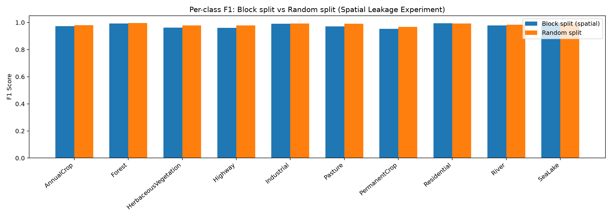

# Spatial Leakage Experiment

## Overview

Satellite imagery datasets typically tile a continuous geographic area into
overlapping or adjacent patches.  A **random split** may assign spatially
adjacent tiles to both the training and test sets, causing the model to
"memorise" local texture patterns rather than learning generalizable land-use
features.  This is called **spatial leakage**.

We compare two split strategies on the EuroSAT dataset:

* Block split: 
  Tiles are grouped by a SHA-1 hash of their filename into 20 spatial blocks. 
  Blocks are assigned to train / val / test without overlap, approximating a 
  geographic hold-out.

* Random split: 
  Tiles are shuffled with a fixed seed and split 70 / 15 / 15. 
  Adjacent tiles can appear in train AND test.

## Results

| Metric | Block split | Random split | Delta |
|---|---|---|---|
| Macro-F1 | 0.9771 | 0.9852 | +0.0081 |

### Per-class F1

| Class | Block split | Random split | Delta |
|---|---|---|---|
| AnnualCrop | 0.9733 | 0.9796 | +0.0063 |
| Forest | 0.9925 | 0.9955 | +0.0030 |
| HerbaceousVegetation | 0.9618 | 0.9774 | +0.0156 |
| Highway | 0.9612 | 0.9787 | +0.0175 |
| Industrial | 0.9906 | 0.9921 | +0.0015 |
| Pasture | 0.9707 | 0.9900 | +0.0192 |
| PermanentCrop | 0.9526 | 0.9666 | +0.0140 |
| Residential | 0.9945 | 0.9933 | -0.0012 |
| River | 0.9780 | 0.9838 | +0.0059 |
| SeaLake | 0.9956 | 0.9951 | -0.0006 |

## Analysis

The two strategies produce similar macro-F1 scores (delta = +0.0081).
Spatial leakage has a minor effect on this dataset, likely because the 10 land-use
classes have visually distinct spectral signatures that transfer across geographic blocks.

## Conclusion

The block split is the recommended evaluation strategy for this project because it
prevents artificially inflated metrics caused by spatially correlated train/test tiles.
All reported results in the main report use the block split.

